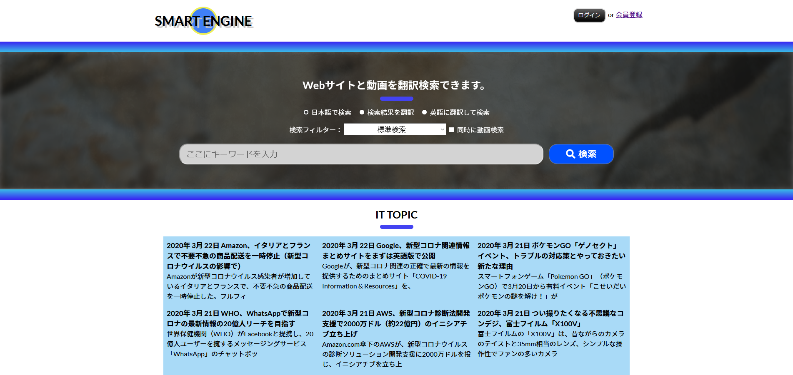

# SMART ENGINE

APIを糞男に使ったサービスとなっております。基本的にはAPIの学習が目的で制作しました。Google Cloud APIの無償体験期間を利用しているので、期間終了後は、Google Translate APIは利用できなくなります。

<ul>主な機能
<li>動画(YouTube)とWebページを一括検索する機能</li>
<li>日本語を英語に翻訳して検索する機能</li>
<li>英語の検索結果を日本語に翻訳する機能</li>
<li>検索結果をストックする機能</li>
<li>検索結果をメールで送信する機能</li>
</ul>

※基本的には会員登録することで、全ての機能が利用できるようにしています。

<strong>以下スクショです。</strong>

ホームイメージ

通常の検索結果

英語の検索結果を日本語に翻訳して表示

